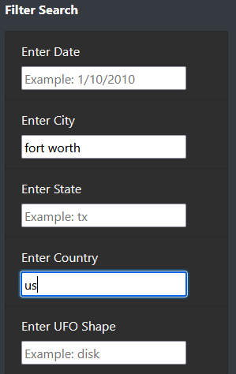

# UFOs

# Overview
The purpose of this project is to display UFO sighting information in a neat, easy to understand layout with interactive elements that enable users to filter the table of UFO information using various search criteria.

# Results

**How to Search**
- All search entries must be in lower case
  - Instead of "TX", write "tx"
- After typing your search query, press the Enter button or click anywhere on the page outside of the search box to run the query
- You may narrow your search results by entering search criteria in more than one search field
  - However, the table cannot filter properly if you enter more than one search criteria in the same search field
  - 
Example Search Entry:

# Summary
