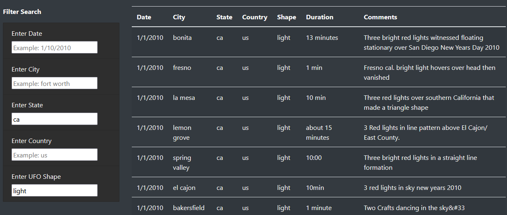

# UFOs

# Overview
The purpose of this project is to display UFO sighting information in a neat, easy to understand layout with interactive elements that enable users to filter the table of UFO information using various search criteria.

Currently all sighting data is limited to January 2010 in the US.

# Results
Below is an explanation of how to use the search filters to sort the table on the webpage.

**How to Search**
- All search entries must be in lower case
  - Instead of "TX", write "tx"
  - Instead of "Fort Worth", write "fort worth"
- Dates must be written in the mm/dd/yyyy format
  - Ex. December 1, 2010 should be written as "12/01/2010"
- After typing your search query, press the Enter button or click anywhere on the page outside of the search box to run the query
- You may narrow your search results by entering search criteria in more than one search field
  - However, the table cannot filter properly if you enter more than one search criteria in the same search field

**Example Search Entry**

(Searching for "light" UFOs in California):

# Summary
**Drawbacks**

Currently, the primary drawback of this webpage is that the search function is still quite primitive, and can easily fail to work if the user input isn't perfect. Another drawback is that there isn't very much feedback for users to determine if their search query was run properly or not, which could lead to confusion. Finally, the dataset is currently only limited to UFO sightings in January 2010 in the US, so it could easily be expanded to include more UFO sightings over a greater period of time and from more countries.

**Potential Improvements**
One way to improve the search function is to remove its case sensitivity, so that users can spell cities, states, and countries with both upper and lower case letters. Also, one useful UX feature to add would be to provide user feedback if their search query failed to match anything in the table. A pop up dialog box would be too intrusive, but perhaps directly beneath the relevant search field, an error message can specify which search criteria the user entered that found no matches. For example, if the user tried to search for "austin" in the City field, the message could say, "found no matches for 'austin'".
